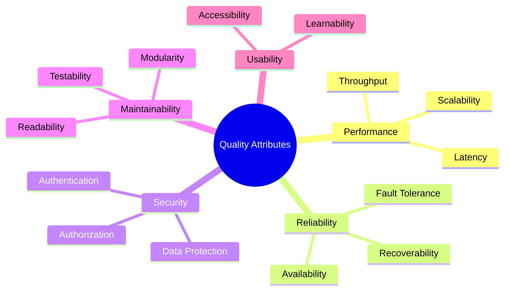
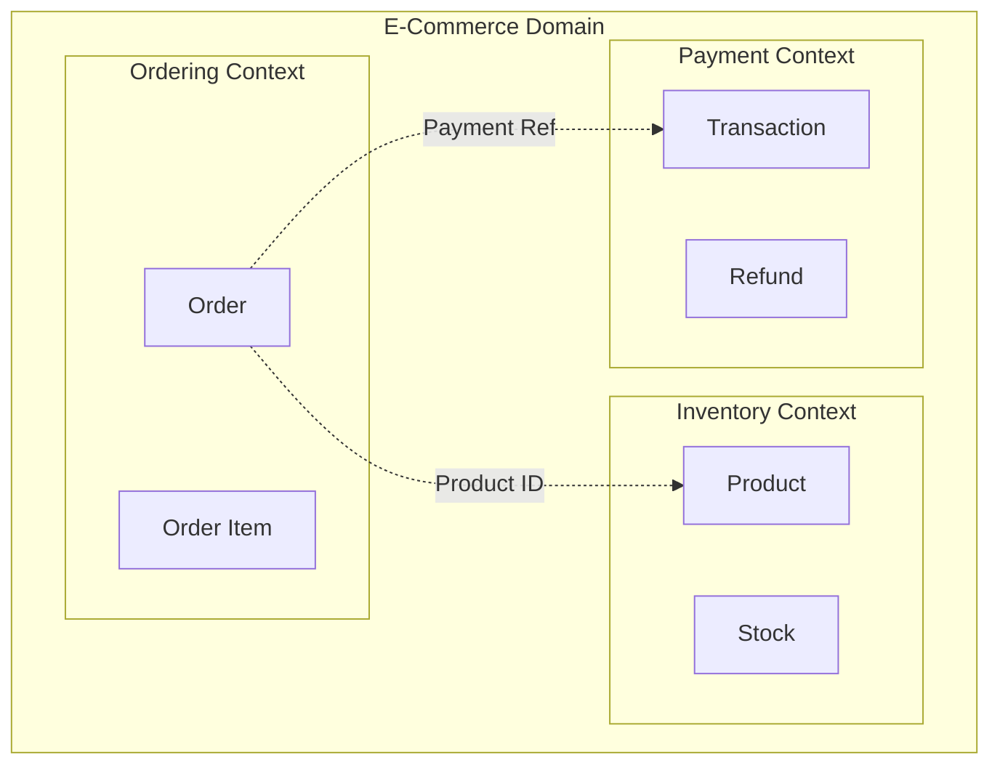
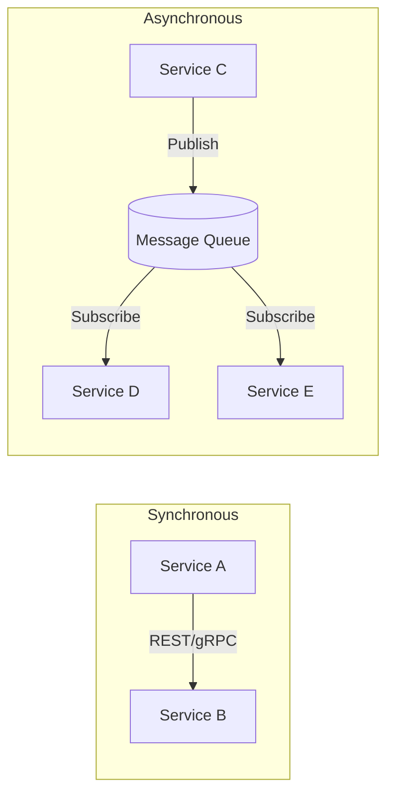
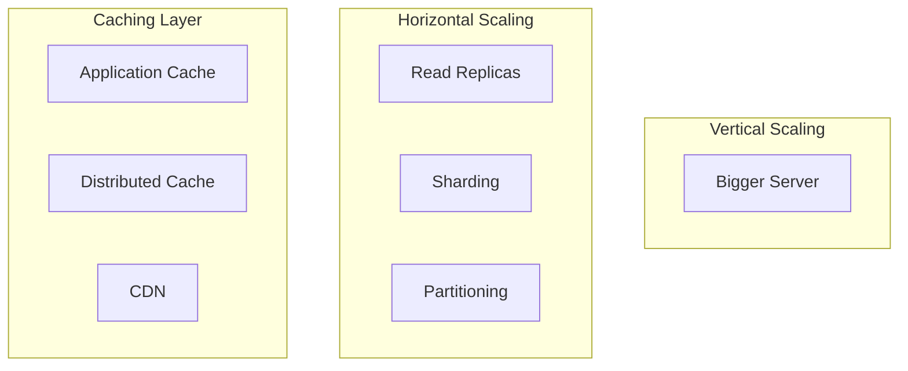
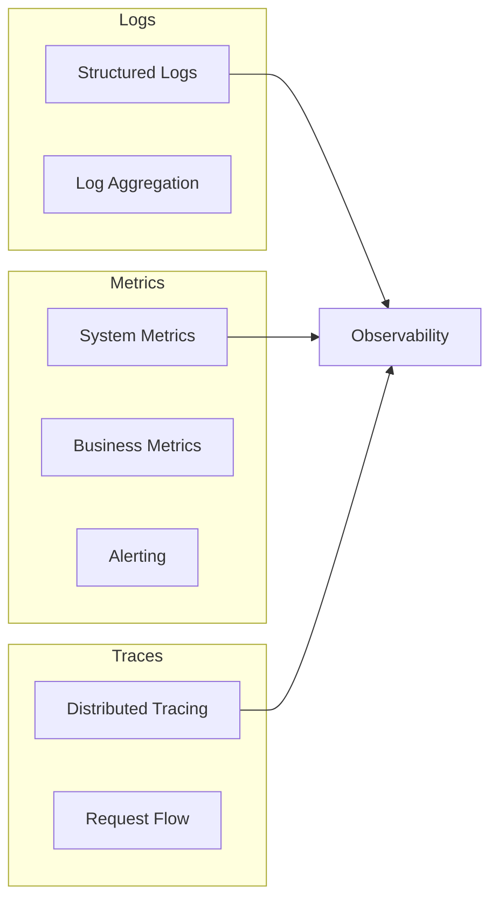

# Software Architecture Instructions

> **Purpose**: Guidelines for AI-assisted software architecture and system design. Follow these principles to create scalable, maintainable, and robust systems.

---

## 1. Architecture Fundamentals

### 1.1 Core Principles

| Principle | Description |
|-----------|-------------|
| **SOLID** | Single Responsibility, Open/Closed, Liskov Substitution, Interface Segregation, Dependency Inversion |
| **DRY** | Don't Repeat Yourself – abstract common patterns |
| **KISS** | Keep It Simple, Stupid – avoid unnecessary complexity |
| **YAGNI** | You Aren't Gonna Need It – don't build for hypothetical futures |
| **Separation of Concerns** | Each module should address one concern |

### 1.2 Quality Attributes



---

## 2. Architecture Patterns

### 2.1 Pattern Selection Guide

| Pattern | Best For | Trade-offs |
|---------|----------|------------|
| **Monolith** | MVPs, small teams, simple domains | Harder to scale, deploy all-or-nothing |
| **Microservices** | Large teams, complex domains, independent scaling | Network complexity, data consistency |
| **Modular Monolith** | Growing systems, transition path | Requires discipline, shared database |
| **Event-Driven** | Async workflows, decoupling | Eventual consistency, debugging complexity |
| **Serverless** | Variable load, cost optimization | Cold starts, vendor lock-in |

### 2.2 Layered Architecture
```
┌─────────────────────────────────────────┐
│           Presentation Layer            │
│    (Controllers, Views, API Endpoints)  │
├─────────────────────────────────────────┤
│           Application Layer             │
│   (Use Cases, Commands, Queries, DTOs)  │
├─────────────────────────────────────────┤
│             Domain Layer                │
│  (Entities, Value Objects, Aggregates)  │
├─────────────────────────────────────────┤
│         Infrastructure Layer            │
│ (Repositories, External APIs, Database) │
└─────────────────────────────────────────┘
```

### 2.3 Clean Architecture
```
┌──────────────────────────────────────────────────┐
│                   Frameworks                      │
│  ┌────────────────────────────────────────────┐  │
│  │              Interface Adapters             │  │
│  │  ┌──────────────────────────────────────┐  │  │
│  │  │          Application Logic           │  │  │
│  │  │  ┌──────────────────────────────┐    │  │  │
│  │  │  │      Domain/Entities         │    │  │  │
│  │  │  │    (Business Rules)          │    │  │  │
│  │  │  └──────────────────────────────┘    │  │  │
│  │  └──────────────────────────────────────┘  │  │
│  └────────────────────────────────────────────┘  │
└──────────────────────────────────────────────────┘

Dependencies point INWARD only.
Inner layers know nothing about outer layers.
```

---

## 3. Domain-Driven Design (DDD)

### 3.1 Strategic Design



### 3.2 Tactical Patterns

| Pattern | Usage |
|---------|-------|
| **Entity** | Objects with identity that persists over time |
| **Value Object** | Immutable objects defined by their attributes |
| **Aggregate** | Cluster of entities with a root entity |
| **Repository** | Abstraction for data access |
| **Domain Service** | Stateless operations that don't belong to entities |
| **Domain Event** | Record of something that happened in the domain |

### 3.3 Aggregate Example
```
┌─────────────────────────────────────┐
│           Order (Aggregate Root)     │
├─────────────────────────────────────┤
│ - id: OrderId                       │
│ - customerId: CustomerId            │
│ - status: OrderStatus               │
│ - items: List<OrderItem>            │
│ - shippingAddress: Address          │
├─────────────────────────────────────┤
│ + addItem(product, quantity)        │
│ + removeItem(itemId)                │
│ + submit()                          │
│ + cancel()                          │
└─────────────────────────────────────┘
         │
         │ contains
         ▼
┌─────────────────────────────────────┐
│         OrderItem (Entity)          │
├─────────────────────────────────────┤
│ - id: OrderItemId                   │
│ - productId: ProductId              │
│ - quantity: Quantity                │
│ - unitPrice: Money                  │
└─────────────────────────────────────┘
```

---

## 4. Microservices Architecture

### 4.1 Service Decomposition Strategies

| Strategy | Description |
|----------|-------------|
| **By Business Capability** | Payment Service, Order Service, User Service |
| **By Subdomain** | Align with DDD bounded contexts |
| **By Data Ownership** | Each service owns its data exclusively |

### 4.2 Communication Patterns



### 4.3 Data Patterns

| Pattern | Description | Use When |
|---------|-------------|----------|
| **Database per Service** | Each service has its own database | Default choice |
| **Saga** | Distributed transactions via events | Cross-service transactions |
| **CQRS** | Separate read/write models | Different read/write requirements |
| **Event Sourcing** | Store events, not state | Audit trails, temporal queries |

### 4.4 Resilience Patterns

```
┌─────────────────────────────────────────────────┐
│                Circuit Breaker                   │
├─────────────────────────────────────────────────┤
│  CLOSED  ──(failures exceed threshold)──> OPEN  │
│    ▲                                        │    │
│    │                                        │    │
│    └──(success)── HALF-OPEN <──(timeout)───┘    │
└─────────────────────────────────────────────────┘
```

- **Retry with Backoff**: Retry failed requests with exponential delays
- **Bulkhead**: Isolate failures to prevent cascade
- **Timeout**: Don't wait indefinitely for responses
- **Fallback**: Provide degraded functionality when service fails

---

## 5. API Design

### 5.1 REST API Design

```yaml
# Resource naming
GET    /api/v1/users           # List users
GET    /api/v1/users/{id}      # Get user
POST   /api/v1/users           # Create user
PUT    /api/v1/users/{id}      # Replace user
PATCH  /api/v1/users/{id}      # Update user
DELETE /api/v1/users/{id}      # Delete user

# Nested resources
GET    /api/v1/users/{id}/orders
POST   /api/v1/users/{id}/orders

# Filtering, sorting, pagination
GET    /api/v1/products?category=electronics&sort=-price&page=1&limit=20
```

### 5.2 API Response Structure
```json
{
  "success": true,
  "data": { ... },
  "meta": {
    "page": 1,
    "limit": 20,
    "total": 100,
    "totalPages": 5
  },
  "links": {
    "self": "/api/v1/products?page=1",
    "next": "/api/v1/products?page=2",
    "prev": null
  }
}
```

### 5.3 Error Response
```json
{
  "success": false,
  "error": {
    "code": "VALIDATION_ERROR",
    "message": "Request validation failed",
    "details": [
      { "field": "email", "message": "Invalid email format" }
    ],
    "traceId": "abc123"
  }
}
```

---

## 6. Database Architecture

### 6.1 Data Modeling Decisions

| Approach | When to Use |
|----------|-------------|
| **Normalization** | Transactional systems, data integrity |
| **Denormalization** | Read-heavy, reporting, speed over consistency |
| **Document Model** | Flexible schemas, hierarchical data |
| **Graph Model** | Heavily connected data, social networks |

### 6.2 Scaling Strategies



### 6.3 Caching Strategy
```
┌──────────────────────────────────────────────────┐
│                 Cache-Aside Pattern               │
├──────────────────────────────────────────────────┤
│  1. Check cache for data                         │
│  2. If miss: fetch from DB, store in cache       │
│  3. Return data                                  │
│                                                  │
│  Write: Invalidate cache, write to DB            │
└──────────────────────────────────────────────────┘

┌──────────────────────────────────────────────────┐
│               Write-Through Pattern              │
├──────────────────────────────────────────────────┤
│  Write: Write to cache AND DB simultaneously    │
│  Read: Always from cache                         │
└──────────────────────────────────────────────────┘
```

---

## 7. Security Architecture

### 7.1 Security Layers

```
┌─────────────────────────────────────────────────┐
│                   Network Layer                  │
│  (Firewall, WAF, DDoS Protection, VPN)          │
├─────────────────────────────────────────────────┤
│                 Application Layer                │
│  (Input Validation, Output Encoding, Auth)      │
├─────────────────────────────────────────────────┤
│                    Data Layer                    │
│  (Encryption at Rest, Column-level Security)    │
├─────────────────────────────────────────────────┤
│                 Infrastructure                   │
│  (IAM, Secrets Management, Audit Logs)          │
└─────────────────────────────────────────────────┘
```

### 7.2 Authentication Patterns

| Pattern | Use Case |
|---------|----------|
| **JWT** | Stateless APIs, microservices |
| **Session** | Traditional web apps |
| **OAuth 2.0** | Third-party authorization |
| **OIDC** | Federated identity |
| **API Keys** | Service-to-service, public APIs |

### 7.3 Zero Trust Principles
- Never trust, always verify
- Least privilege access
- Assume breach mentality
- Micro-segmentation
- Continuous verification

---

## 8. Observability

### 8.1 Three Pillars



### 8.2 Key Metrics (Four Golden Signals)

| Signal | Description | Example |
|--------|-------------|---------|
| **Latency** | Time to service a request | p50, p95, p99 response times |
| **Traffic** | Demand on the system | Requests per second |
| **Errors** | Rate of failed requests | 5xx rate, error ratio |
| **Saturation** | How "full" the service is | CPU, memory, queue depth |

### 8.3 Logging Best Practices
```json
{
  "timestamp": "2024-01-15T10:30:00Z",
  "level": "ERROR",
  "service": "order-service",
  "traceId": "abc123",
  "spanId": "def456",
  "userId": "user-789",
  "message": "Failed to process order",
  "error": {
    "type": "PaymentDeclined",
    "message": "Insufficient funds"
  },
  "context": {
    "orderId": "order-123",
    "amount": 99.99
  }
}
```

---